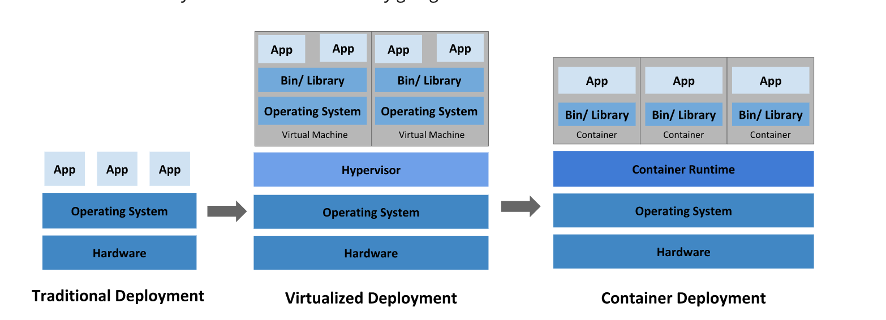

# Containers
A container is a standard unit of software that packages up code and all its dependencies so the application runs quickly and reliably from one computing environment to another. A Docker container image is a lightweight, standalone, executable package of software that includes everything needed to run an application: code, runtime, system tools, system libraries and settings.

This decoupling allows container-based applications to be deployed easily and consistently, regardless of whether the target environment is a private data center, the public cloud, or even a developer’s personal laptop. Containerization provides a clean separation of concerns, as developers focus on their application logic and dependencies, while IT operations teams can focus on deployment and management without bothering with application details such as specific software versions and configurations specific to the app.

For those coming from virtualized environments, containers are often compared with virtual machines (VMs). You might already be familiar with VMs: a guest operating system such as Linux or Windows runs on top of a host operating system with virtualized access to the underlying hardware. Like virtual machines, containers allow you to package your application together with libraries and other dependencies, providing isolated environments for running your software services. As you’ll see below however, the similarities end here as containers offer a far more lightweight unit for developers and IT Ops teams to work with, carrying a myriad of benefits.

# Why Containers

Instead of virtualizing the hardware stack as with the virtual machines approach, containers virtualize at the operating system level, with multiple containers running atop the OS kernel directly. This means that containers are far more lightweight: they share the OS kernel, start much faster, and use a fraction of the memory compared to booting an entire OS.

- Consistent Environment
- Run Anywhere
- Isolation

# Container Orchestration 

Container orchestration is the automation of much of the operational effort required to run containerized workloads and services. This includes a wide range of things software teams need to manage a container’s lifecycle, including provisioning, deployment, scaling (up and down), networking, load balancing and more.

