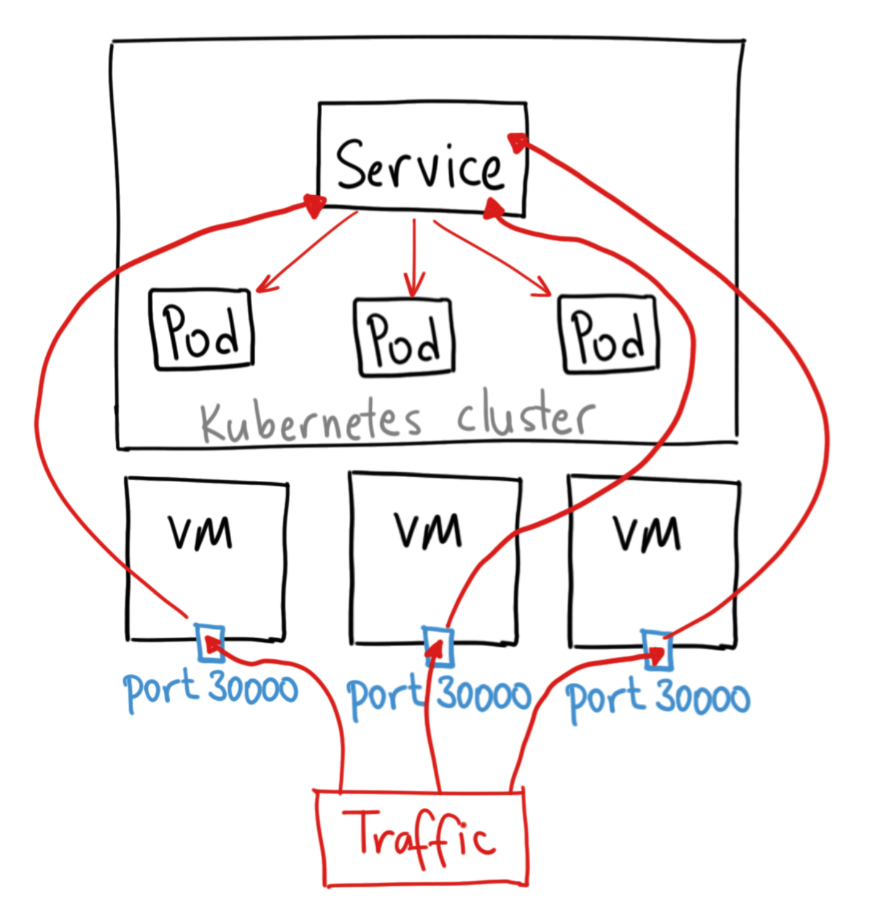
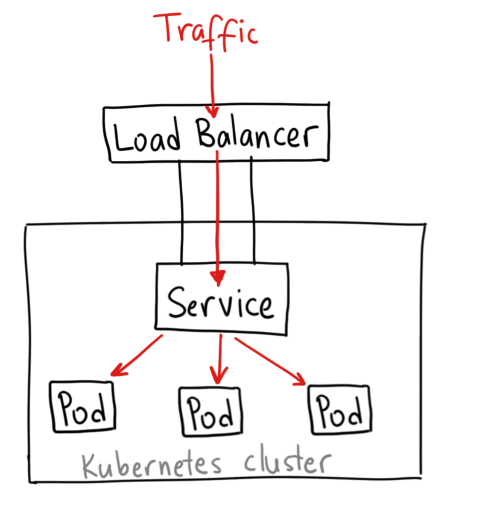
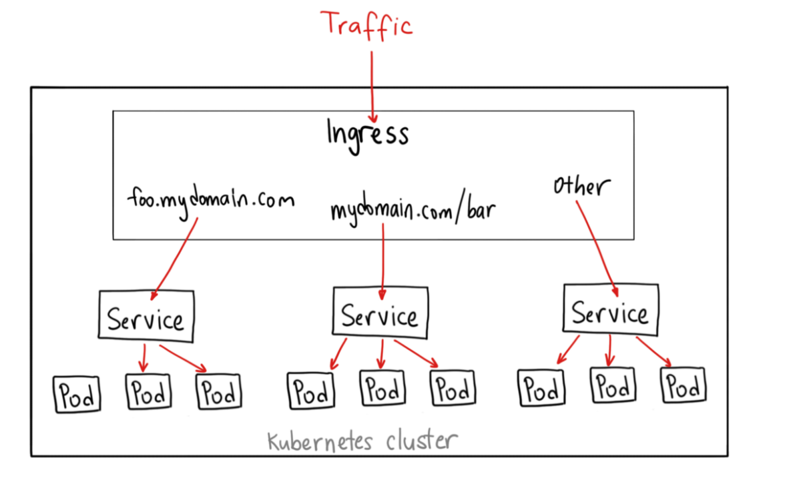

# Exposing a Service outside of Kubernetes Cluster

We have seen in the earlier section , how we can expose a service internally within the Kubernetes Cluster. 
In this section , we will talk about how we can expose a service outside kubernetes cluster.

# NodePort

This is particular type of kubernetes service which expose the exposes the service on each Node's IP at a static port.
You'll be able to contact the NodePort Service, from outside the cluster, by requesting <NodeIP>:<NodePort>
A ClusterIP Service, to which the NodePort Service routes, is automatically created.



Sample Yaml

```
apiVersion: v1
kind: Service
metadata:
  name: basic-node-js-app
  labels:
    name: basic-node-js-app
spec:
  selector:
    name: basic-node-js-app
  type: NodePort
  ports:
    - protocol: TCP
      port: 80
      targetPort: 8080
      nodePort: 30036
```

Scenario which you can look into https://learning.oreilly.com/scenarios/7-2-ckad-services/9781098105327/

# LoadBalancer

A LoadBalancer service is the standard way to expose a service to the internet. On cloud providers which support external load balancers, setting the type field to `LoadBalancer` provisions a load balancer for your Service.



Sample Yaml

```
apiVersion: v1
kind: Service
metadata:
  name: basic-node-js-app
  labels:
    name: basic-node-js-app
spec:
  selector:
    name: basic-node-js-app
  type: LoadBalancer
  ports:
    - protocol: TCP
      port: 80
      targetPort: 8080
```

## Internal Load balancer

Some cloud provider also supports creating a load balancer service which is type of Internal meaning the loadbalancer will not get a public IP Address.
The configuration which enables this option might vary between different cloud providers.

https://kubernetes.io/docs/concepts/services-networking/service/#internal-load-balancer

# Ingress

Ingress exposes HTTP and HTTPS routes from outside the cluster to services within the cluster. Traffic routing is controlled by rules defined on the Ingress resource.
An Ingress may be configured to give Services externally-reachable URLs, load balance traffic, terminate SSL / TLS.



In order to make Ingress's to work, we needed to have an Ingress Controller installed in our cluster.  An Ingress controller is responsible for fulfilling the Ingress, usually with a load balancer.

There are different types of Ingress Controller present in the market
https://kubernetes.io/docs/concepts/services-networking/ingress-controllers/


Please have a look on 09-basic-node-app-ingress.yaml for the sample Ingress configuration details.